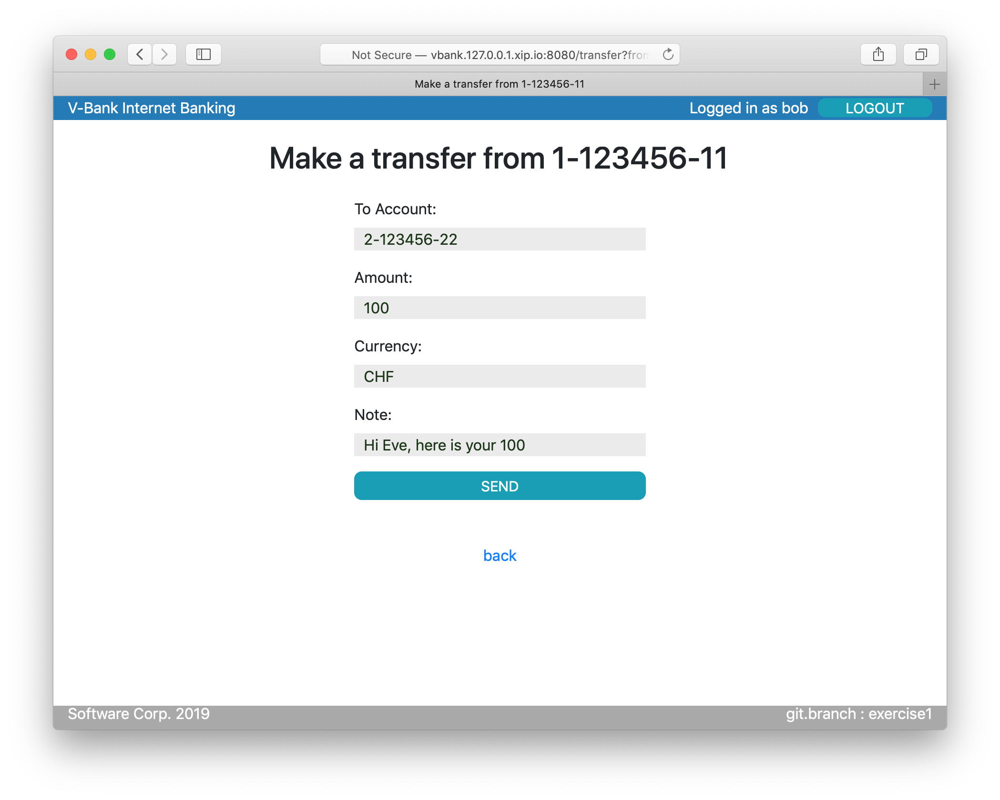
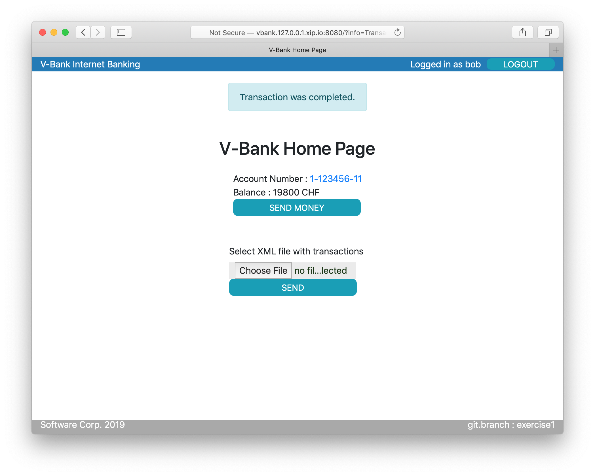
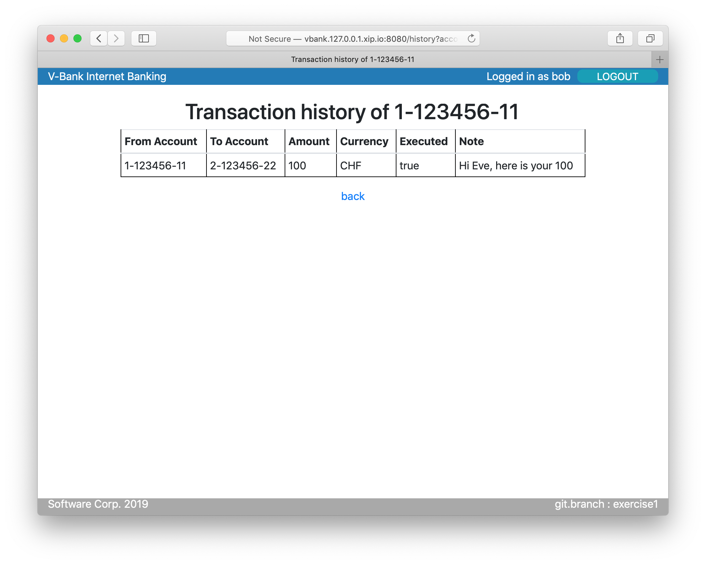
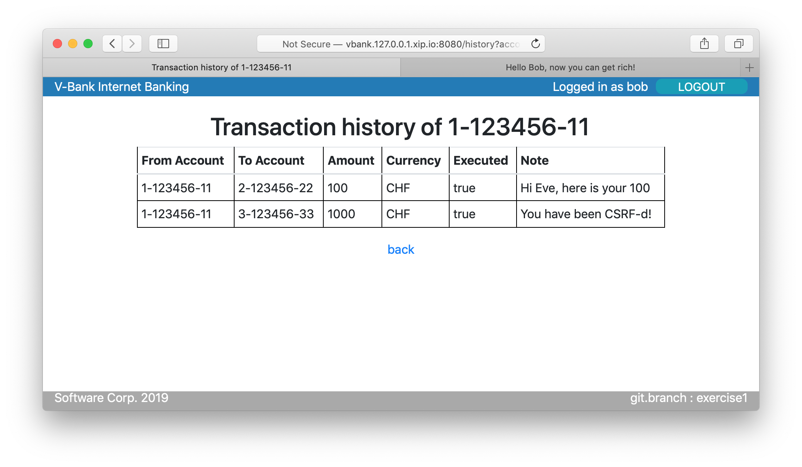

# Exercise 1 - CSRF

CSRF with this exercise to help you understand CSRF and its most common mitigation

## Setup and Start Applications

1. check out exercise1 
   * choose branch 'exercise1' in the 'VCS -> Git -> Branches' menu within IntelliJ
1. start the v-bank-app in debug mode
   * start the Maven configuration for the "v-bank-app" in DEBUG mode (with the green BUG icon next to the arrow)
   (you should have created it as described in point __2.2. of the Workspace Setup Instructions__ at https://github.com/vargadan/v-bank/blob/master/README.md)
1. start the attacker-app
   * start the Maven configuration for the "v-bank-app" in DEBUG mode (with the green BUG icon next to the arrow)
   (you should have created it as described in point __2.2. of the Workspace Setup Instructions__ at https://github.com/vargadan/v-bank/blob/master/README.md)
1. open v-bank app and log in 
   1. open http://vbank.127.0.0.1.xip.io:8080/ in the browser
   1. login with as 'bob' with password 'h3ll0bob'
   1. click on send money and wire 100 CHF to eve:
      * account no: 2-123456-22
      * amount: 100 
      * currency: CHF
      * note: 'Hi Eve here is you 100!'

    
   1. go the transaction history page by clicking on the account number on the home page to see the transactions executed.
   
1. now on behalf of alice we execute a CSRF attack against bob
  1. alice tricks bob into open a web page under her control:
     * http://attack.127.0.0.1.xip.io:9090/csrf
     * if you open the page source you see that it contains a pre filled form posted at the url handling transactions forms 
     
  1. as (little careless) Bob open the above page and click on the button
  1. then go back to the transactions page and refresh it you will see that you are 1000 CHF worse off because you have been CSRF-ed
  
  
  
## Understand how the CSRF attack is working with 

Please only do it if you feel confident with IntelliJ and the Burp proxy tool

  1. setup tools for HTTP interception and Java debugging
     * start the Burp tool to intercept http calls
        * in the Proxy > Options tab change the proxy port from 8080 to 8181 so that it does not conflict with the v-bank application
        * change your browser's proxy to 127.0.0.1:8181 in its settings
        * make sure that Intercept is ON in the Burp tool (Proxy > Intercep tab)\
        Important! : please do not open any other pages in the Browser while doing this exercise as their requests will also be intercepted by the Burp proxy and it may easily confuse you. 
     * Place a debug breakpoint in *BankController.doTransfer(...)* (*BankController* class *doTransfer* method)
  1. refresh any v-bank application page (i.e. the home page at http://vbank.127.0.0.1.xip.io:8080/) and intercept the http request 
     * Please note the JSESSION cookie value in the Burp tool (this is the ID of Bob's current user session)
     * Forward this and all subsequent requests
  1. go to the csrf attack page and click on the button again so that the CSRF call gets interecpted by Burp
     * Please note the JSESSION cookie value in the Burp tool (it should be the same as the one with the previous application request)
     * Forward this and all subsequent requests
  1. Now execution should stop at the Breakpoint
     * if you expand the transaction method parameter its properties should be properly populated
     * if you resume the program (F9 in IntelliJ) the transaction will be properly executed
     
## Mitigations
* Possible mitigations against CSRF
  * protect session cookie with samesite attributes 
    * lax if normal GET requests are safe and modifications are behind POST (or PUT/DELETE)
    * strict otherwise
    * unfortunately depends on web-framework / server if possible
  * protect forms with CSRF token
    * additional token 
* for more detailed explanations please see: https://github.com/OWASP/CheatSheetSeries/blob/master/cheatsheets/Cross-Site_Request_Forgery_Prevention_Cheat_Sheet.md


## Fix
* since same-site session cookies are not supported by the current application framework (JEE Servlet 2.3 and Spring 5) we have to revert to other methods
* Spring security support CSRF tokens out of the box, which is disabled in this exercise so that CSRF can be demonstrated
* we are going to add our own CSRF filter (filter means that it intercepts all incoming requests and responses and can block/change them) instead to understand how token based mitigation works against CSRF.\
The code of a simple anti CSRF filter:
```
@Component
@Order(1)
public class CsrfFilter implements Filter {


    @Override
    public void doFilter(ServletRequest request, ServletResponse response, FilterChain chain) throws IOException, ServletException {
        validate((HttpServletRequest) request, (HttpServletResponse) response);
        chain.doFilter(request, response);
        setToken((HttpServletRequest) request, (HttpServletResponse) response);
    }

    /**
     * Check the POST request if the container a valid _csrf parameter as csrf protection token
     *
     * @param request
     * @param response
     * @throws ServletException
     */
    private void validate(HttpServletRequest request, HttpServletResponse response) throws ServletException {
        if ("POST".equals(request.getMethod().toUpperCase())) {
            String csrfTokenIn = request.getParameter("_csrf");
            String csrfTokenExp = (String) request.getSession().getAttribute("csrfProtectionToken");
            if (!csrfTokenExp.equals(csrfTokenIn)) {
                throw new ServletException("Invalid CSRF token!");
            }
        }
    }

    /**
     * Sets the csrf token value as a session attribute with name 'csrfProtectionToken'
     *
     * @param request
     * @param response
     */
    private void setToken(HttpServletRequest request, HttpServletResponse response) {
        String csrfProtectionToken = (String) request.getSession(true).getAttribute("csrfProtectionToken");
        if (csrfProtectionToken == null) {
            csrfProtectionToken = UUID.randomUUID().toString();
            request.getSession().setAttribute("csrfProtectionToken", csrfProtectionToken);
        }
    }
}
```  
What does this class do?
Well, 2 things:
1. It checks if the CSRF token exists in the session. If not it creates a token and saves it in the session.\
(The view logic should read it from the session and place it in the form as a hidden value).
2. It checks all incoming POSTS requests if they contain a valid CSRF token by reading the token value from the request parameters and comparing it with the value saved in the session. 
(It checks only POST requests because you should only use POST for sending forms that modify or create something)
It throws an Exception if there is no valid CSRF token value coming in as a parameter with the POST request.
\
Add the a hidden input of name *_csrf* to the transfer form in *transfer.jsp* to make sure that the CSRF token value is sent as a parameter with the POST request when saving the transaction:\
` <input type="hidden" name="_csrf" value="${csrfProtectionToken}"/>`
\(in _transfer.jsp_)

## Verify fix
Having added the CsrfFilter and the token parameter to the form the CSRF request from the attacker site should be blocked.
You can verify it by placing a break-point in *CsrfFilter.validate(...)* 

The solution is avaliable in the _exercise1-solution_ branch at https://github.com/vargadan/v-bank/tree/exercise1-solution
\
The relevant changes are:
* the new CsrfFilter class in _CsrfFilter.java_
* the money transfer html form in _transfer.jsp_ 
