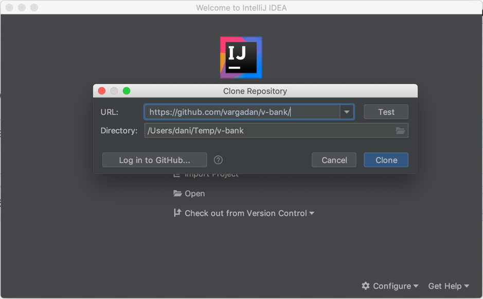
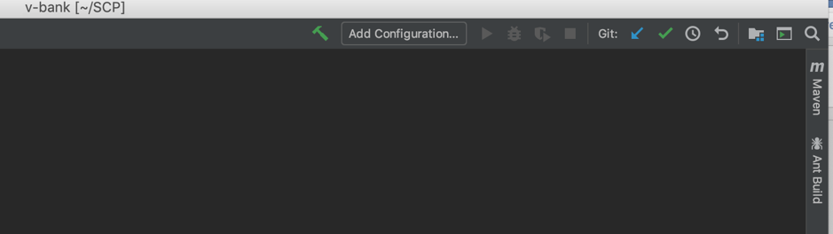
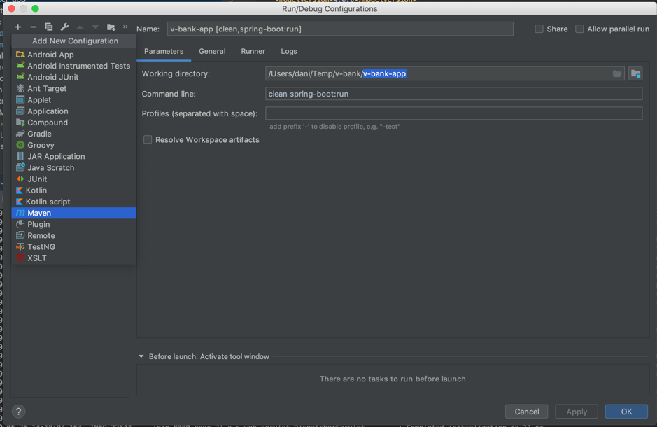
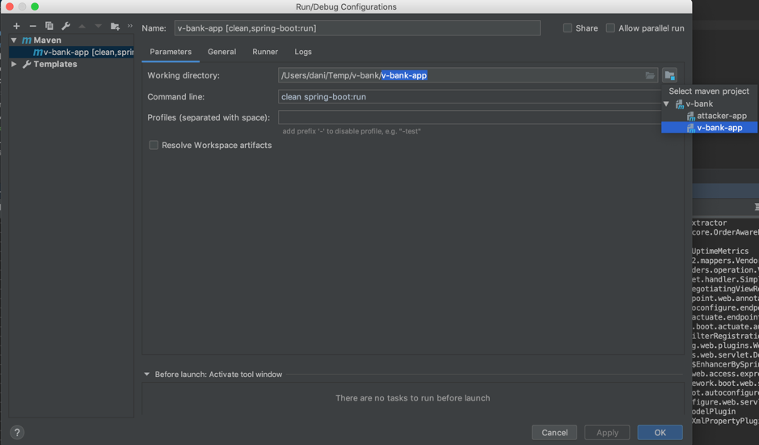
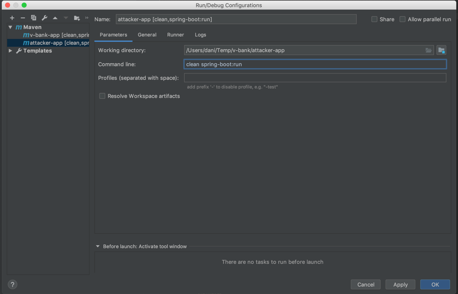
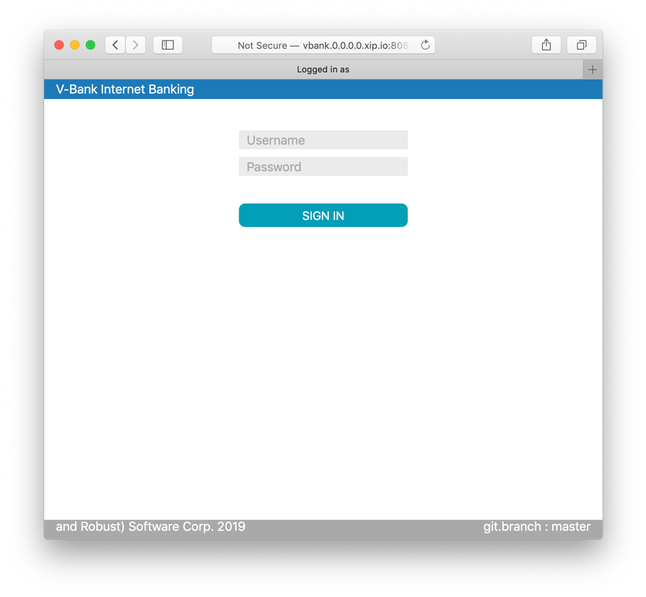
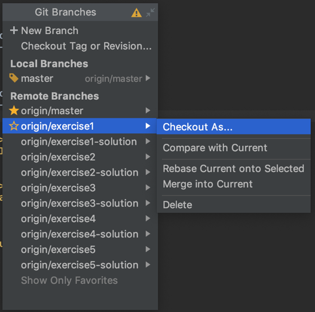
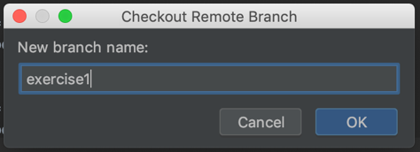
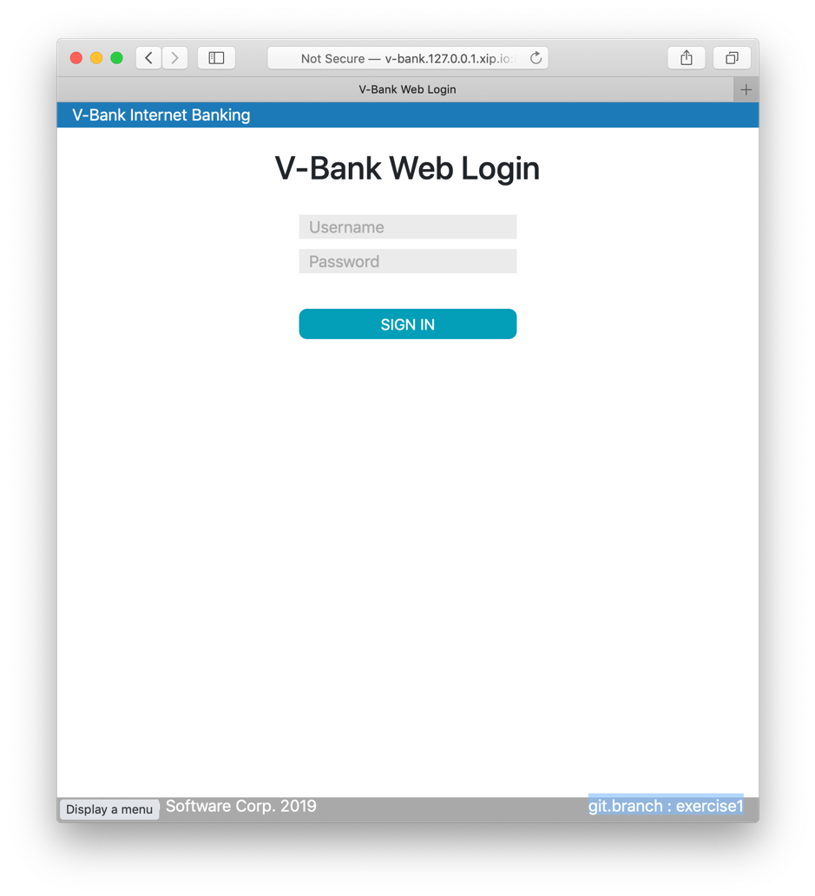

# Vulnerable E-Bank Demo with Exercises

## 1. Tool Requirements

*	If you do not have it yet (you can check it with “java -version on the command line”); please download and install the latest Java Development Kit JDK from:
https://www.oracle.com/technetwork/java/javase/overview/index.html
The latest version (12 as of now) is ok.
*	If you do not have it yet (you can check it with “git --version”, on the command line);
please download and install the latest GIT command line client from:
https://git-scm.com/downloads 
*	Download and Install IntelliJ Idea Community Edition from: https://www.jetbrains.com/idea/download/
*	Install the Lombok plugin for InelliJ:
Preferences > Plugins > Marketplace > search for Lombok (by Michail Plushnikov) and install it. 
(Lombok is a java library that plugs in into the build tool and generates otherwise boilerplate code, hence it saves us valuable time writing that. 
The Lombok annotations you may find in the code of our examples are, for example: @AllArgsConstructor, @NoArgsConstructor, @Getter, @Setter, etc.)
*	Burp Suite Community Edition: https://portswigger.net/burp/communitydownload

## 2. Setup workspace

### 2.1. Check Out Project from Version Control (GitHub)

You do not need a GitHub account to check the project out!
The URL of the project on GitHub is: https://github.com/vargadan/v-bank 

Steps:
   1. On the welcome screen you click/select “Check Out From Version Control”
   1. You enter the above URL of the project.
   1. And let IntelliJ download and configure it. 
  

If IntelliJ asks: “You have checked out an IntelliJ project file: …/pom.xml
Would you like to open it?”, you should answer “Yes”.
This checks out our v-bank project from GitHub.
Please wait till IntelliJ parses all the poms, imports the modules and builds the project. 
When it is all done the project has 2 modules:
*	v-bank-app: it is a very simple or say dummy e-bank application full of vulnerabilities.
*	attacker-app: this is just a placeholder for simple tools and scripts we will use to attack the previous application.

### 2.2. Create run configurations for the application modules 

The two application modules are v-bank-app and attacker-app in the …/v-bank/v-bank-app and /v-bank/attacker-app folders.
Click on “Add configuration” in the header button bar.

Add a maven configuration with command line “clean spring-boot:run” and with working directory of the home folders of the modules v-bank-app and attacker-app
(this will clean and build the project before launching the spring-boot application)
__Important!__: Please pay attention to the home folder of the launch configurations: They should be the folders of the modules ../v-bank-app and /attacker-app; both ending in ‘-app’!

Add a new __Maven__ configuration:

__Make sure you have 2 configurations!__:

1. _v-bank-app_ configuration:
   * working directory: _[PATH_TO_PROJECT_ROOT]/v-bank-app_
   * command line:      _clean spring-boot:run_ 
1. _attacker-app_ configuration:
   * working directory: _[PATH_TO_PROJECT_ROOT]/attacker-app_
   * command line:      _clean spring-boot:run_

where _[PATH_TO_PROJECT_ROOT]_ is the path into where you checked the v-bank project out.

  
### 2.3. Run the v-bank-app maven run configuration.

This will launch the application on the local port of 8080. However, instead of accessing the running application on localhost we are going to use a xip.io domain (so that our attacks work):
http://v-bank.127.0.0.1.xip.io:8080/
The valid username and password are: bob / h3ll0bob 
(other credentials of all users can be found in the file data.sql, 
you may search for it with CTRL+SHIFT+N(windown/linux) or CMD+SHIFT+N(mac))
 
Valid credentials are: bob / h3ll0bob 
(other credentials can be found in the file data.sql, you may search for it with the hotkey CTLR/CMD+SHIFT+N)

You can now stop the application (by hitting on the red square).

### 2.4. Switch to the branch of the first exercise.

The exercises we are going to make are based on branches they are:
1. exercise1: CSRF
1. exercise2: XSS
1. exercise3: SQL injection
1. exercise4: Deep Modelling with Types
1. exercise5: XXE 

The solutions of the exercises are in a corresponding branch:
1. exercise1-solution
1. exercise2-solution
1. exercise3-solution
1. exercise4-solution
1. exercise5-solution

When running the application you should see “git.branch : {banch-name}” in the right- lower corner, so that you can see which branch or exercise the currently running application belongs to. 
When freshly checked out you should be on the “master” branch.

You can change branch at the following menu item in IntelliJ: VCS -> Git -> Branches

Check out exercise1 as “exercise1”. (Please not when you check a branch out for the 1st time it will be amongst the Remote Branches as you can see on the above screenshot). 

When you (re)start the application you should see now “git.branch : exercise1” in the right-lower corner as on the screenshot below. 

__Congratulations! You have set up your workspace succesfully!__
